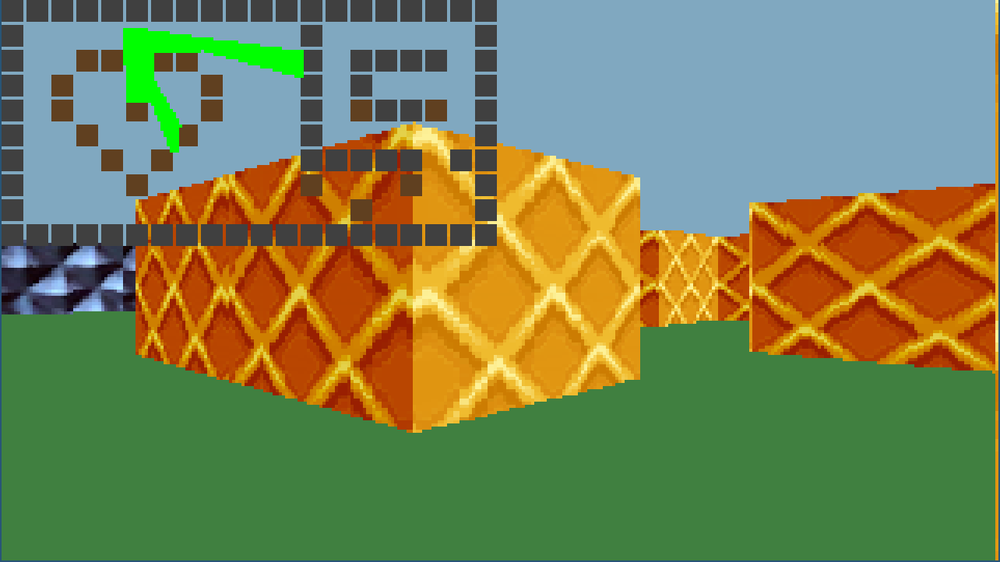

 raycaster
============

> Raycasting schickt für jedes Pixel des Betrachters (des zu berechnenden Bilds) einen Sehstrahl (Primärstrahlen) durch das Volumen. Der Strahl wird innerhalb des Volumens verfolgt und die Farb- und Opazitätswerte in regelmäßigen Abständen an den Abtast-Punkten auf dem Strahl bestimmt. Es wird ebenfalls die Schattierung an allen Abtastpunkten, für die Farbwerte, berechnet. Der so erhaltene Vektor, für den Sehstrahl, enthält die geordneten Abtast-Werte (Farb-, Opazitätswerte), wobei die Farbwerte dem Quellterm und die Opazitätswerte dem Extinktionskoeffizienten entsprechen. In einem letzten Schritt, dem Compositing, werden dann die Farb- und Opazitätswerte kombiniert und das aus dem Sehstrahl resultierende Pixel in der Bildebene errechnet.  
> *(aus der [Wikipedia](https://de.wikipedia.org/wiki/Raycasting))*
